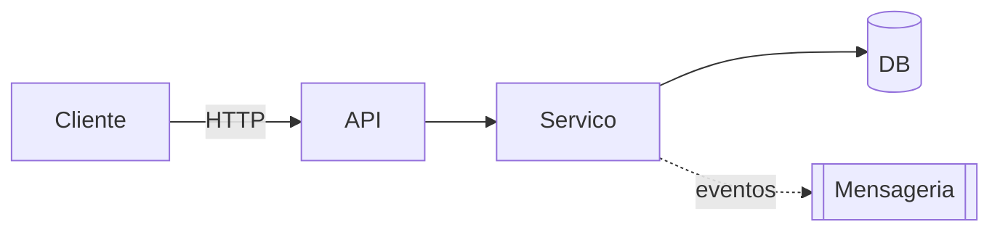

# Target Architecture

> Arquitetura alvo do sistema novo, respeitando o paradigma escolhido em `paradigm_decision.md` e a estratégia confirmada em `migration_strategy.md`.

## Visão geral
<Resumo em 3 a 6 linhas: o que é o sistema novo, qual paradigma ele segue, quais bordas tem com o legado durante a migração.>

## Diagrama (Mermaid)

## Componentes

| Componente | Tipo | Responsabilidade | Origem (legado / novo / fundido) |
|---|---|---|---|
| <nome> | API / Serviço / Worker / DB / Fila | <texto> | <ref para legado ou "novo"> |

## Bounded contexts

### BC-01: <nome>
- **Responsabilidade**: <texto>
- **Justificativa do agrupamento / separação**: <por que esse contexto não foi decomposto 1-para-1 a partir do legado>
- **Componentes internos**: <lista>
- **Eventos publicados** (se paradigma event-driven): <lista>
- **Eventos consumidos**: <lista>

<repetir por contexto>

## Decisões arquiteturais (ADR-style resumido)

### AD-01: <título>
- **Decisão**: <texto>
- **Alternativas descartadas**: <lista>
- **Justificativa**: <texto, ligando a paradigma, estratégia e apetite>
- **Rastreabilidade**: <referência ao legado ou ao discard_log>

## Honra ao paradigma escolhido

> Seção obrigatória quando há mudança de paradigma. Demonstra que a arquitetura honra a decisão de `paradigm_decision.md`.

- **Paradigma alvo**: <do `paradigm_decision.md`>
- **Como a arquitetura honra esse paradigma**:
  - <ex: event-driven → eventos explícitos, schemas de mensagem, estratégia de consistência eventual>
  - <ex: OO com DI → interfaces, container de injeção, bordas claras entre camadas>
  - <ex: funcional → tipos imutáveis, composição, ausência de side effects no domínio>

## Bordas com o legado durante a migração
- <ex: durante o Strangler Fig, a API nova reroteia chamadas do legado X até a fase Y>

## Notas
<Observações de design adicionais.>
